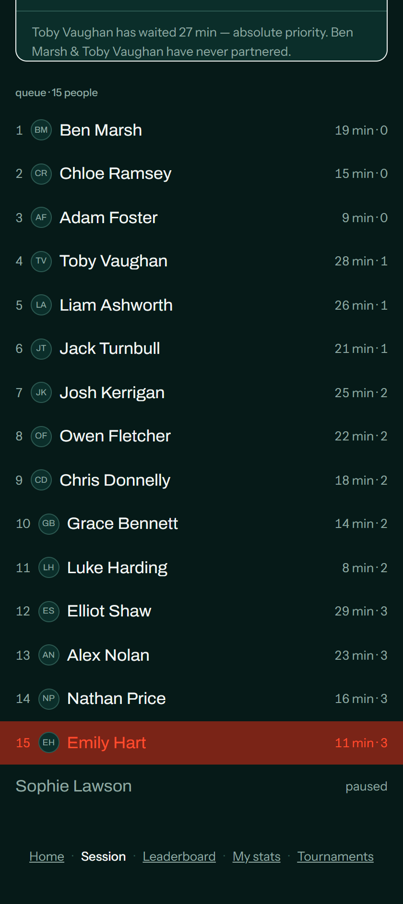
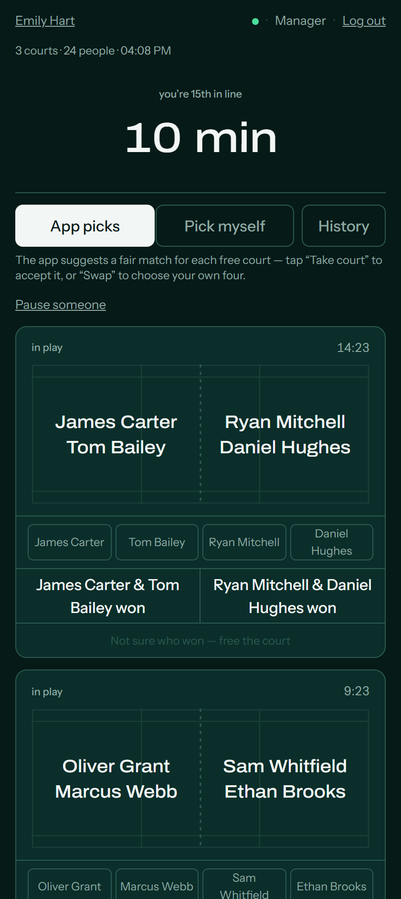
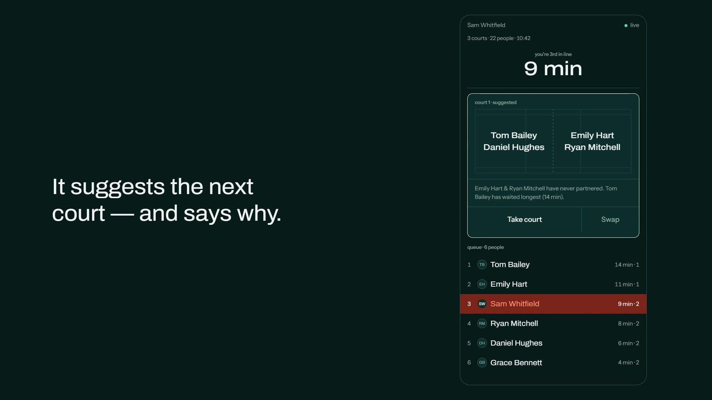

# Badminton Queue

**Fair matches and who's up next — every Saturday.**

A mobile-web session manager for a badminton club: ~22 people, 3 courts, two
hours, doubles. It decides who plays next, explains *why* in one sentence, and
runs off a single tap — because the person organising is also playing.

<table>
<tr>
<td width="50%"></td>
<td width="50%"></td>
</tr>
</table>

### 🏸 [Try the live demo →](https://vlong.tuuhyped.co.uk)

A real deployment on a seeded club — **every name in it is fictional**. Pick any
name to see the queue from that player's point of view, or sign in as an
organiser to actually run a court:

| | code |
|---|---|
| Manager — take courts, record results, swap players, pause people | `demo-mgr` |
| Admin — create sessions, edit the roster | `demo-adm` |

The interesting thing to try: open a suggested court, read the sentence
explaining *why* those four, then tap **Take court** and watch the queue
re-order.

[](https://vlong.tuuhyped.co.uk/demo.mp4)

▶ **[Watch the 24-second demo](https://vlong.tuuhyped.co.uk/demo.mp4)** — plays in
the browser. The screenshots below are the real app running against that same
seeded data.

---

## The problem

A real club, a real constraint:

> Everyone only ever plays with their friends. The app exists to **mix people
> up** — and it has to do that without anyone leaving the court to tap a phone.

Three consequences shape every decision in this repo:

| Constraint | What it forced |
|---|---|
| The organiser is playing too | One tap to run a court. No admin console mid-session. |
| Courts finish at different times | No "rounds" — the queue is continuous and re-evaluated per court |
| 11 of 22 people are sitting out | The default screen serves the **waiting**, not the playing |

---

## Try it in 60 seconds

No Firebase account needed — it runs against the local Firestore emulator with
30 fake players, four finished sessions and one live session mid-flow.

```bash
npm install

# terminal 1 — the emulator
npx firebase emulators:start --only firestore

# terminal 2 — seed a fake club, then run
FIRESTORE_EMULATOR_HOST=localhost:8085 node scripts/seed-demo.cjs
FIRESTORE_EMULATOR_HOST=localhost:8085 \
NEXT_PUBLIC_FIRESTORE_EMULATOR=localhost:8085 \
npm run dev
```

The seeder **refuses to run** unless `FIRESTORE_EMULATOR_HOST` is set, so it can
never touch a real database.

```bash
npm run test:safe    # 121 tests, no credentials, no network
```

---

## The parts worth reading

**[`firestore.rules`](firestore.rules) — writes are impossible from the client.**
Every write goes through the Admin SDK server-side. The reasoning is in the file:
two phones finishing at the same time could otherwise both grab the same player.

**[`lib/firestore.ts`](lib/firestore.ts) — the client proposes, the server approves.**

```
20:14:03  court 1 finishes → client A picks "An, Binh, Cuong, Dung"
20:14:05  court 2 finishes → client B picks "An, Binh, Em, Phong"
                                             ↑↑ An and Binh taken TWICE
```

The whole live session is one Firestore document, so the transaction is atomic by
definition. The losing transaction re-reads inside the same document, sees the
player already taken, and throws `ConflictError`.
[`tests/firestore-uc5.test.ts`](tests/firestore-uc5.test.ts) fires both writes
concurrently and asserts exactly one wins — and that the loser's other two
players are left untouched rather than half-locked.

**[`lib/matchmaking.ts`](lib/matchmaking.ts) — a two-tier engine that explains
itself.** Tier 1 gates who is eligible (sorted by games played, not wait time —
that's what people actually argue about). Tier 2 scores candidate fours on pair
novelty and balance. Tier 3 is a hard starvation constraint: anyone waiting over
25 minutes is forced in.

Every suggestion ships with one sentence of reasoning:

> *Toby Vaughan has waited 28 min — absolute priority. Ben Marsh & Toby Vaughan
> have never partnered.*

Without that sentence the app is a dictator; with it, it's a referee. People
argue with referees, but they accept them.

**[`lib/rating.ts`](lib/rating.ts) — TrueSkill in 60 lines**, no dependency. Ratings
stay hidden until they converge: a "62–38" prediction from three games is a lie
that fails publicly in front of 22 people.

**[`app/CourtDiagram.tsx`](app/CourtDiagram.tsx) — the court card *is* a court.**
Real doubles geometry in hairlines, names in their true halves. You look up at the
court, then down at the phone, and see the same shape — recognition instead of
reading. Long names compress via SVG `textLength` rather than overflowing.

---

## Design

The interface is the court: white on court green, and **colour is signal, not
decoration** — exactly one hot colour exists, appearing only when something
concerns *you*. Everything else is hairlines. No gradients, no shadows, no
glassmorphism; a badminton court is a flat plane.

| Decision | Why |
|---|---|
| Touch targets ≥ 56px | Sweaty hands, out of breath (HIG says 44pt — this is deliberately above it) |
| Actions in the lower half | One-handed, standing up |
| Dark mode only | High-bay hall lighting; a white screen glares |
| `tabular-nums` on everything that ticks | Otherwise digits jump and the eye re-reads |
| Queue always visible to everyone | The most-argued-about thing at every club on earth |
| Pause/un-pause needs no code | The person who sees a court free up isn't the one holding the code |

Full reasoning in [`UI.md`](UI.md).

---

## Architecture

```
Next.js 16 (App Router) ·  TypeScript ·  Tailwind v4
                │
       ┌────────┴────────┐
   client SDK         API routes
  (reads only)      (all writes)
       │                 │
       └────────┬────────┘
           Firestore
      one doc per session
```

- **Reads** go straight from the browser to Firestore via `onSnapshot` — live,
  no polling, never through the server.
- **Writes** only ever happen server-side inside a transaction.
- **The pure core** (`types.ts`, `rating.ts`, `matchmaking.ts`) has no I/O, no
  clock and no randomness — `now` and `rng` are injected parameters. That's what
  makes 121 tests possible without a database.
- **`lib/repo.ts`** defines the slice of Firestore the app uses, with two
  implementations: real (`repo-fs`) and in-memory (`repo-mem`). Tests exercise
  the *real* business logic against the fake store.

Detail in [`ARCHITECTURE.md`](ARCHITECTURE.md).

---

## Tests

```
121 offline  ·  npm run test:safe
```

| Suite | What it covers |
|---|---|
| `engine.test.ts` | Matchmaking and rating — pure, deterministic, 38 tests |
| `repo-mem` / `rebuild` | The data layer against the in-memory store |
| `tournament` / `tournament-live` | Bracket import, standings, live scoring |
| `firestore-uc5` | The double-booking race, against real Firestore |

Two techniques worth a look: the engine is intentionally random, so tests assert
on **distributions** across 200 runs (`0/200` for "a stale pair is never
re-paired", `100/100` for "anyone waiting >25 min is always forced in"); and the
race-condition test uses `Promise.allSettled` to fire two competing writes and
assert that exactly one survives.

---

## Documentation

| File | What's in it |
|---|---|
| [`docs/DECISIONS.md`](docs/DECISIONS.md) | **Start here** — why the tests and the interface are built this way |
| [`ARCHITECTURE.md`](ARCHITECTURE.md) | Data model, transaction layer, degraded modes |
| [`UI.md`](UI.md) | The design system and the reasoning behind it |
| [`USECASES.md`](USECASES.md) | 20 use cases from the real club |
| [`LEADERBOARD.md`](LEADERBOARD.md) | Why most stats are deliberately *not* shown |
| [`PROMPT.md`](PROMPT.md) | The original build spec |
| [`docs/DEMO-DEPLOY.md`](docs/DEMO-DEPLOY.md) | How the public demo is isolated from the club's live data |

---

## Notes

**Built with AI assistance**, which is visible in the commit history. The
engineering judgement is documented alongside it: a protected pure core that
stays frozen once validated, experiments that were tried and **rejected with
numbers** (adding decay to pair history dropped mixing coverage 78.8% → 76.9%),
a written list of features deliberately not built, and a test suite as the gate.

**Demo data only.** Every name in this repository is fictional. Real club data
lives in environment-configured Firestore and has never been committed.

**Stack:** Next.js 16 · React 19 · TypeScript · Tailwind v4 · Firebase Firestore
· deployed on Vercel.

## License

[MIT](LICENSE)
